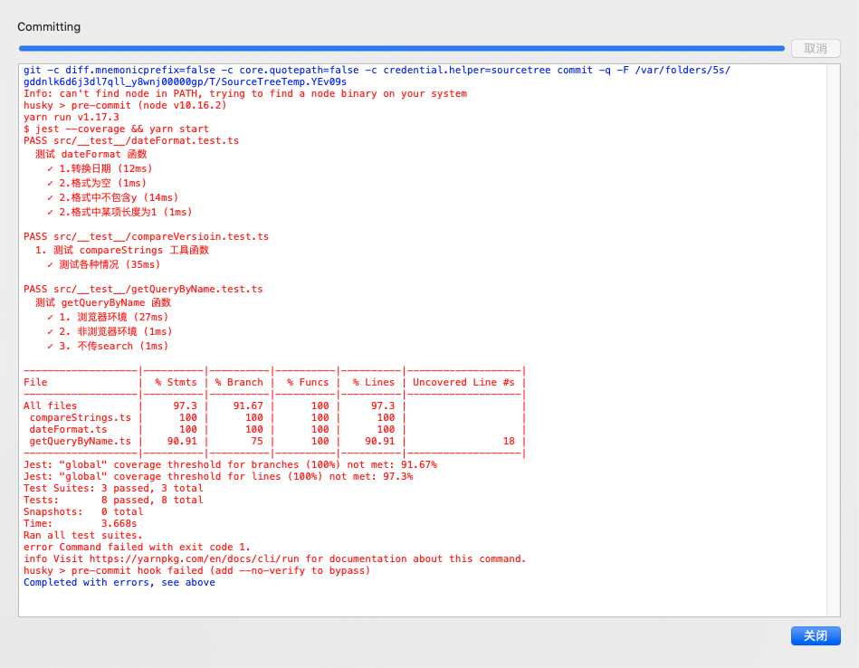

## 1.3.0
1. 添加5个函数
- getPx
- px2rem
- retryPromise
- getDeviceId、generateDeviceId

2. 添加 node 端测试用例

## 1.2.0
1. 添加5个函数
- createBaseUrl
- getBase64Image
- getImage
- handleStylePx2rem
- timeoutPromise

## 1.1.0
1. 添加tree shaking

## 0.0.3
1. 添加eventListener对象，它是一个简单版本的发布订阅模式控制器。

## 0.0.2
**代码相关**
1. 测试覆盖率达到100%
2. 对于 getQueryByName 获取的参数的值，将以前的unescape 解码更改为 decodeURIComponent 解码。更多信息：https://developer.mozilla.org/zh-CN/docs/Web/JavaScript/Reference/Global_Objects/unescape
3. 移除依赖lodash和@care/logger

**其他**
1. 添加tsconfig.compile.js文件，它继承tsconfig.js。tsconfig供编辑器识别其中的include和exclude配置，因为ts也需要检查src/__test__目录，但是通过tsc编译的时候不需要编译__test__目录，所以在tsconfig.compile.js中排除src/__test__目录。使用yarn build编译ts文件时指定配置文件`tsc -p tsconfig.compile.json`。
2. 添加husky，对git commit进行yarn test。如果测试覆盖了不到100%，禁止提交。如果你需要跳过该钩子（不推荐），参考：https://github.com/typicode/husky/issues/124
